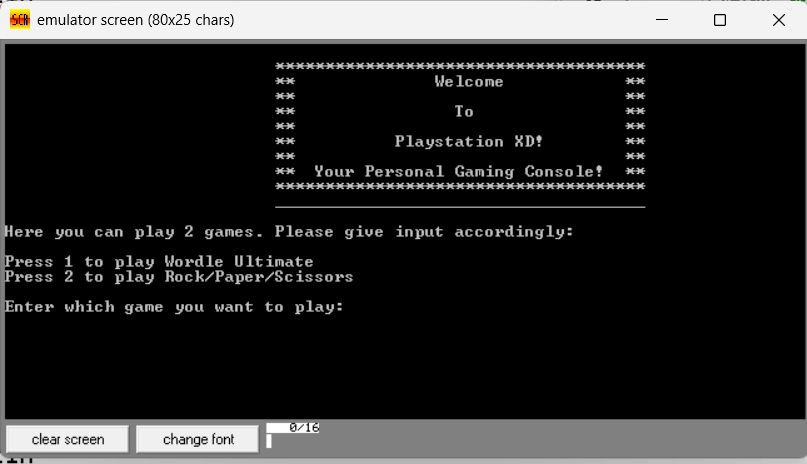
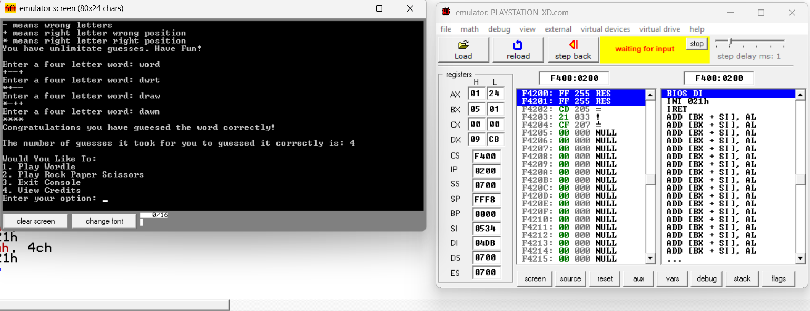
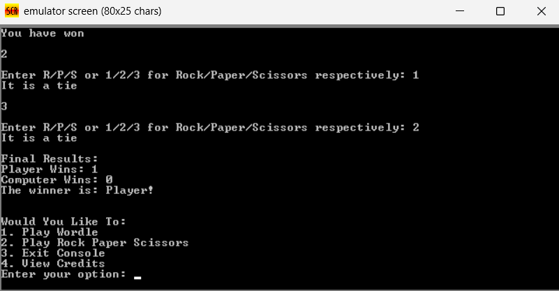

# Playstation XD - Assembly Language Game Console

A fun gaming console made entirely in **8086 Assembly Language**. It includes two games: **Wordle Ultimate** and **Rock Paper Scissors**.

**Course:** Assembly Language  
**Submitted to:** Tanjim Reza Sir & Md. Muhtasim Mahmud Sir

---

## Games Included

1. **Wordle Ultimate** - Guess the 4-letter word
2. **Rock Paper Scissors** - Classic game with multiple rounds

---

## Features
- Beautiful welcome screen with ASCII art
- Two complete games in one console
- Score tracking in Rock Paper Scissors
- Rules displayed for both games
- Play again option
- Credits section

---
## How to Run

1. Install **DOSBox** or **EMU8086**
2. Clone or download this repository
3. Open the `.asm` file in EMU8086
4. Assemble and Run

**File Location:** `code/Playstation XD! (1).asm`

## Screenshots

## Group Members
- Rizwanul Islam (21201129)
- Fahima Hasin Khan (21301319)
- Abrar Jawad (21201701)

**Made with using 8086 Assembly**
